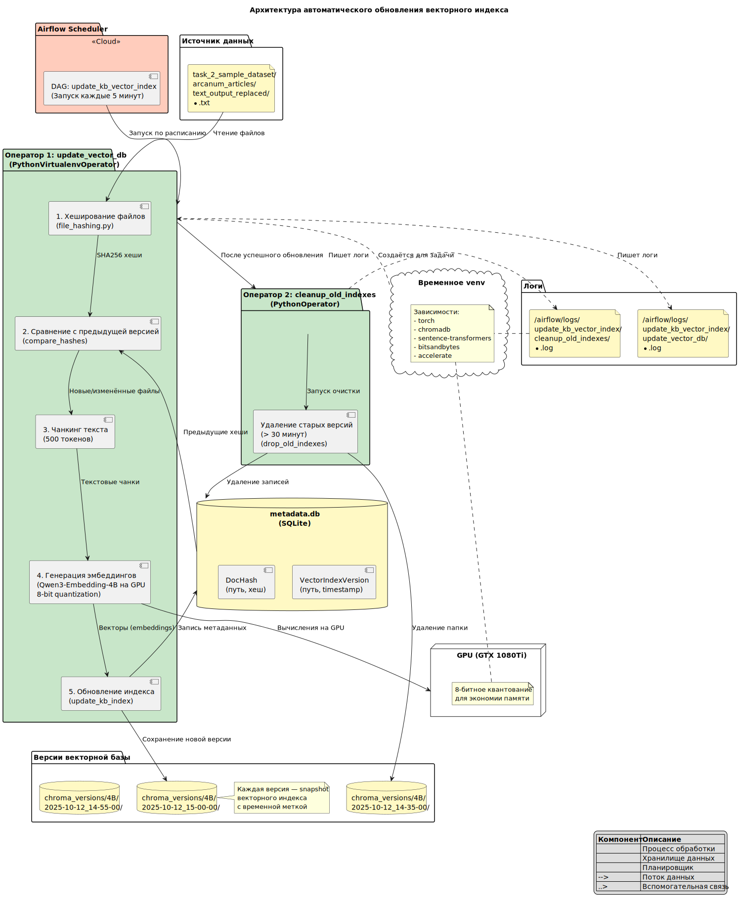
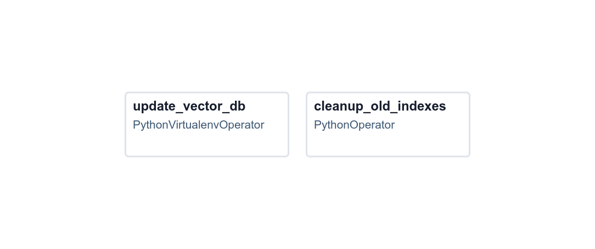
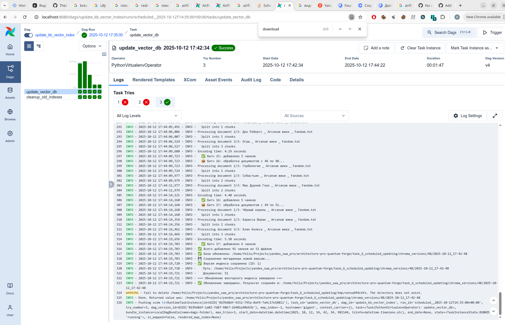

# Задание 6. Автоматическое ежедневное обновление базы знаний

Здесь мы делаем DAG под `airflow`, который будет периодически осматривать директорию с txt-файлами, искать там изменения (проверка хеша) и пересчитывать эмбеддинги только для изменившихся файлов.

Мы открываем предыдущую версию Chroma-базы (если есть), и вносим изменения: 
- для новых файлов считаем новые эмбеддинги;  
- для изменённых файлов удаляем старые эмбеддинги, считаем новые
- для удалённых файлов просто удаляем старые эмбеддинги.

Новую версию Chroma-базы сохраняем в новую директорию, делаем запись в БД SQLite (`metadata.db`)
Старые версии Chroma-базы (старше N дней) удаляем.

## Архитектура системы



Какой именно тип диаграммы имелся в виду в задании, я не понял, так что сгенерировал с помощью Claude Sonnet что бог на душу положит (получился какой-то странный гибрид между Component Diagram, Deployment Diagram и Data Flow Diagram). Я пока не знаю DataFlow Diagram, так что править не стал: ситуацию отражает и ладно = )

## Структура DAG



DAG `update_kb_vector_index` (файл `dags/dag.py`) содержит два последовательных оператора:

### 1. `update_vector_db` — PythonVirtualenvOperator
Обновляет векторный индекс базы знаний:
- **Функция:** `update_vector_db_task()` (определена в `dag.py`)
- **Вызывает:** `update_kb_index()` из `update_chroma_db.py`
- **Что делает:**
  - Вычисляет хеши всех файлов в директории базы знаний
  - Сравнивает с предыдущей версией (из SQLite БД)
  - Обновляет только изменённые файлы: считает эмбеддинги на GPU с 8-битным квантованием (Qwen3-Embedding-4B)
  - Сохраняет новую версию Chroma-базы в `chroma_versions/4B/YYYY-MM-DD_HH-MM-SS/` (с временной меткой)
  - Записывает метаданные в SQLite БД (`metadata.db`)
- **Виртуальное окружение:** создаётся временное venv с зависимостями (torch, chromadb, sentence-transformers, bitsandbytes, accelerate)

### 2. `cleanup_old_indexes` — PythonOperator
Удаляет устаревшие версии индекса:
- **Функция:** `cleanup_old_indexes_task()` (определена в `dag.py`)
- **Вызывает:** `drop_old_indexes()` из `cleanup_indexes.py`
- **Что делает:**
  - Ищет в SQLite БД версии старше 30 минут
  - Удаляет директории с Chroma-базами
  - Удаляет записи из БД метаданных
- **Окружение:** использует основное окружение Airflow (только SQLAlchemy)

**Зависимость:** `update_vector_db` >> `cleanup_old_indexes` (очистка запускается только после успешного обновления)


# Как запустить

```bash
uv run airflow db reset -y
AIRFLOW__CORE__DAGS_FOLDER=$(pwd)/dags AIRFLOW__CORE__LOAD_EXAMPLES=false uv run airflow standalone
```

И заходим в http://localhost:8080, юзер `admin` пароль см. в `~/airflow/simple_auth_manager_passwords.json.generated`


_DAG на airflow_

Логи по умолчанию лежат в `~/airflow/logs`, я надёргал несколько логов для примера:

### Примеры логов запусков:

1. **[Холодный запуск (индексация всех файлов)](some_logs/run_id=scheduled__2025-10-12T14-35-00+00-00/task_id=update_vector_db/attempt=3.log)**  
   Первый запуск системы — индексируем все файлы базы знаний с нуля.

2. **[Обновление базы (изменения обнаружены)](some_logs/run_id=scheduled__2025-10-12T14-55-00+00-00/task_id=update_vector_db/attempt=1.log)**  
   Удалено несколько файлов, один файл добавлен, один изменён. Система обновляет только изменённые части индекса.

3. **[Проверка без изменений](some_logs/run_id=scheduled__2025-10-12T15-00-00+00-00/task_id=update_vector_db/attempt=1.log)**  
   Изменений не найдено — база остаётся без обновлений.

4. **[Очистка старых версий](some_logs/run_id=scheduled__2025-10-12T15-20-00+00-00/task_id=cleanup_old_indexes/attempt=1.log)**  
   Задача `cleanup_old_indexes` удаляет версии Chroma-базы старше 30 минут. В этом примере удалено 2 индекса.


